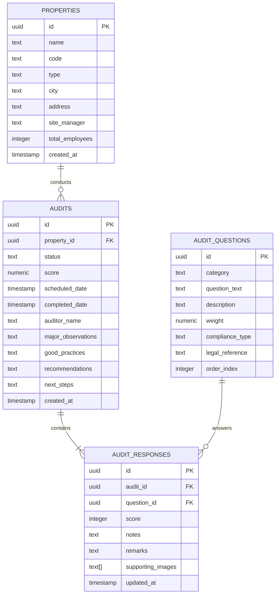

# 🛡️ Ivy League House (ILH) EHS & Operations Auditing Platform

> **The Single Source of Truth for Environment, Health, Safety (EHS) and Business Operations Compliance across the Ivy League House Ecosystem.**

Welcome to the **ILH Audits** platform—a comprehensive, legally compliant, and high-fidelity enterprise audit management application custom-engineered for **Ivy League House (ILH)**. It moves the entire organizational audit workflow from static spreadsheets to a dynamic, real-time analytics and reporting engine.

---

## 📖 Table of Contents
1. [🌟 Core Platform Features](#-core-platform-features)
2. [📋 Comprehensive EHS Framework & Marking Schema](#-comprehensive-ehs-framework--marking-schema)
3. [⚖️ Statutory Compliance & Legal Reference Alignment](#%EF%B8%8F-statutory-compliance--legal-reference-alignment)
4. [🛠️ Technology Stack & Architecture](#%EF%B8%8F-technology-stack--architecture)
5. [🗄️ Database Schema & Relational Design](#%EF%B8%8F-database-schema--relational-design)
6. [🚀 Quick Start & Development Guide](#-quick-start--development-guide)
7. [📈 Production Deployment & Verification](#-production-deployment--verification)

---

## 🌟 Core Platform Features

*   **📊 Executive Compliance Trends Dashboard**: Live-renders a highly interactive historical compliance trends chart using **Recharts**. Supports side-by-side comparison across properties (e.g., *ILH Pune Pilot* and *Student Village Ahmedabad*), tracking scores across fiscal periods.
*   **📑 High-Fidelity Executive Audits View**: Interactive timeline of all completed and pending audits. Provides instant details on overall score, categories audit performance, and specific audit questions.
*   **🩺 Deep-Dive Executive Summaries**: Built-in executive summaries capturing **Major Observations**, **Good Practices**, **Recommendations**, and **Next Steps** to streamline executive review.
*   **⚖️ Statutory Legal Reference Tagging**: Seamless integration of legal references (e.g., *BOCWA S.44*, *Factories Act 1948*, *MSDS Standards*) inline with audit questions to ensure compliance and audit-readiness.
*   **🖼️ Multi-Image Evidence Gallery & Lightbox**: Dynamic image thumbnail grid for failed items. Clicking any thumbnail opens a premium full-screen lightbox with multi-image slider controls, remarks, and audit notes.
*   **🔐 Advanced State Management**: Uses **Zustand** and a robust local-storage-backed mock Supabase client for a zero-latency, full-fidelity standalone demonstration experience.
*   **🎨 Premium Modern UI**: Adheres to high-fidelity dark-mode aesthetics, elegant gradients, fluid hover micro-animations, and complete responsive design for mobile tablets and desktop.

---

## 📋 Comprehensive EHS Framework & Marking Schema

The system implements a weighted scorecard model across **5 core categories** consisting of **16 precise auditable parameters**:

### 1. Scorecard Weights & Categories
| Category ID | Category Name | Weight | Focus Areas |
| :---: | :--- | :---: | :--- |
| **C1** | PGHP & Core Operations | **25%** | Standard Operating Procedures, General Hygiene |
| **C2** | EHS Documentation & Legal Compliance | **25%** | Statutory registers, HIRA, fire safety approvals, licenses |
| **C3** | Mechanical, Electrical & Lift Safety | **20%** | Preventive maintenance, lift compliance, earthing/LOTO |
| **C4** | Chemical, Waste & Material Management | **15%** | MSDS compliance, segregation, hazardous waste storage |
| **C5** | Emergency Preparedness & Subcontractor Safety| **15%** | Drill logs, PPE compliance, subcontractor insurance |

### 2. Standardized Marking & Action Schema
Auditors score each parameter using either a **1-5 Likert scale** or a **Yes/No binary compliance** system. The backend automatically calculates weighted category scores and flags operational compliance.

| Score | Status | Definition | Operational Action / Escalation |
| :---: | :--- | :--- | :--- |
| **5** | **Exceptional** | Flawless execution; exceeds baseline ILH standards. | Standard logging; celebrated as a Good Practice. |
| **4** | **Compliant** | Meets all standards; very minor, non-operational defects. | Standard logging; logged for periodic correction. |
| **3** | **Acceptable** | Functional, but requires scheduled maintenance. | Low-priority corrective action; tracked in monthly plan. |
| **2** | **Deficient** | Out of compliance; creates operational or hygiene risks. | **Triggers Medium Alert**: Email to Site Manager; 7-day SLA. |
| **1** | **Critical** | Major safety risk or statutory non-compliance. | **Triggers High Alert & Escalation**: Immediate alert; 24-hr SLA. |

---

## ⚖️ Statutory Compliance & Legal Reference Alignment

The platform integrates actual statutory references directly inside the checklist questions to ensure audit rigor. Key statutory references include:

*   **BOCWA (Building and Other Construction Workers Act), Section 44**: Governing safety measures, welfare provisions, and operational standards.
*   **Factories Act 1948**: Regulating safety guards, lift fitness certifications, machinery inspection frequencies, and employee health logs.
*   **Indian Electricity Rules 1956**: Mandating systematic double-earthing verification, lightning arrestor inspections, and LOTO (Lockout/Tagout) protocols.
*   **MSDS (Material Safety Data Sheets) & Hazardous Waste Rules**: Governing safe storage, labeling, chemical spill response kits, and licensed vendor disposal of e-waste and chemicals.

---

## 🛠️ Technology Stack & Architecture

The application is built on top of a cutting-edge web stack optimized for rapid loading, robust typings, and pristine styling:

*   **Framework**: [Next.js 16 (App Router)](https://nextjs.org/) utilizing React Server Components (RSC) and Client Components where appropriate.
*   **Styling**: [Tailwind CSS v4](https://tailwindcss.com/) for a highly performant utility-first styling pipeline.
*   **State Management**: [Zustand](https://github.com/pmndrs/zustand) for reactive, zero-boilerplate client-side database management and UI interactions.
*   **Charts**: [Recharts](https://recharts.org/) for highly performant and accessible vector compliance trend charts.
*   **Database Layer**: [Supabase](https://supabase.com/) Client (Local storage-backed mock client v5.0 automatically handles standalone review while preserving actual DB layout sync).

---

## 🗄️ Database Schema & Relational Design

The database represents a rigorous relational structure optimized for audit integrity:

### Relational Entity-Relationship Flowchart


---

## 🚀 Quick Start & Development Guide

### 📋 Prerequisites
- **Node.js** (v18.x or later recommended)
- **npm** (v9.x or later)

### 💻 Installation
Clone the repository and install all node packages:
```bash
# Install package dependencies
npm install
```

### 🏃‍♂️ Running the Dev Server
Fire up the local development server:
```bash
npm run dev
```
Open [http://localhost:3000](http://localhost:3000) on your favorite browser. The application automatically redirects you to the Login screen. Use any dummy credentials to log in and access the dashboard!

---

## 📈 Production Deployment & Verification

### 🔍 Static Code Checking & Type Checking
Verify code linting and TypeScript compile validity:
```bash
# Type check TypeScript files without generating output
npx tsc --noEmit
```

### 📦 Building for Production
Compile the app into an optimized Next.js production build:
```bash
# Run production build compilation
npm run build
```

### 🚢 Deploying
This app is ready to deploy on **Vercel** or **Firebase App Hosting**. Simply connect your Git repository and hit Deploy. The framework automatically parses all App Router routes and static endpoints.

---

*Developed with ❤️ for Ivy League House.*
