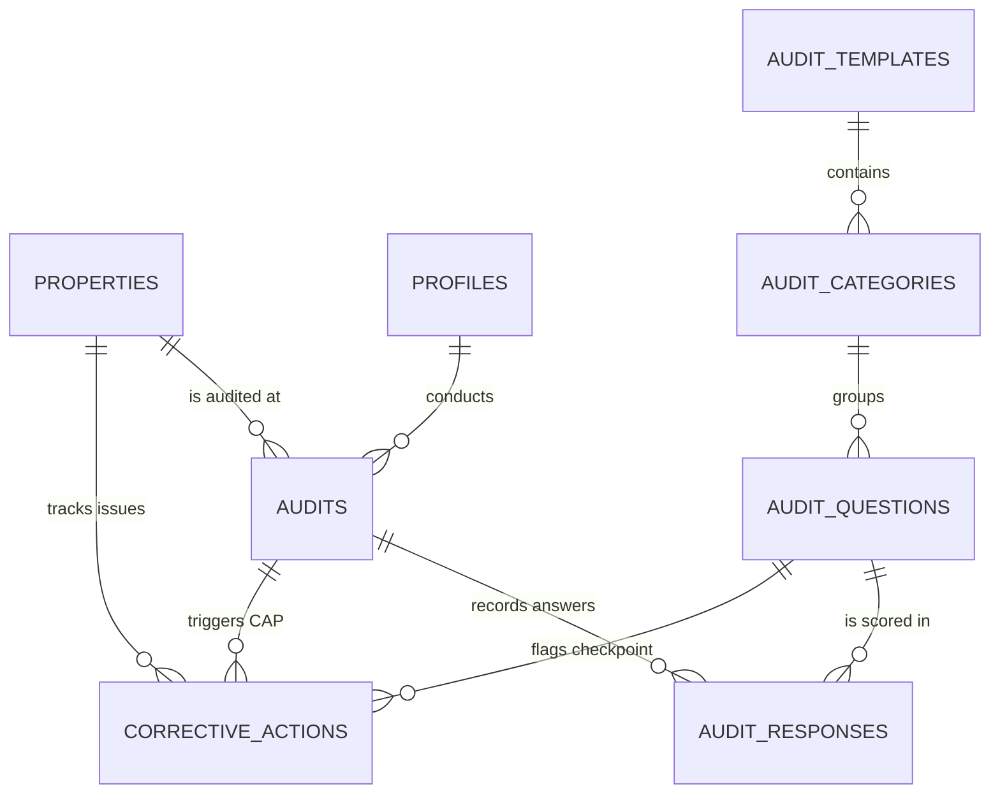

# ILH Audits — Premium Technical & User Manual

Welcome to the premium documentation for the **ILH Audits** (Ivy League House) Property Quality and Compliance Management system. 

This document serves as the comprehensive guide for developers, operations managers, and founders to understand the database architecture, application logic, and user workflows.

---

## 1. High-Level Technology Stack

The application is built using modern web industry standards:
- **Framework:** Next.js (App Router, Server Components & Client Hooks).
- **Database / Backend:** Supabase (PostgreSQL with Row Level Security, Storage Buckets, and SSR Cookie-based Session Auth).
- **Styling:** Tailwind CSS + custom glassmorphic CSS utilities.
- **Component System:** shadcn/ui (Radix Primitives) + Lucide Icons.
- **State Management:** Zustand (with sessionStorage persistence for in-progress audit drafts).

---

## 2. Database Schema Design (PostgreSQL)

The database is built on PostgreSQL with strict Row Level Security (RLS) policies to protect student-housing records.

### Core Tables & Specifications

#### 1. `properties`
Stores all student housing locations across India (e.g., Pune, Mumbai, Delhi, Bengaluru).
- `id` (UUID, Primary Key)
- `name` (TEXT, Not Null) — e.g. "ILH Tathawade"
- `location` (TEXT, Not Null)
- `total_beds` (INTEGER) — Total bed capacity
- `created_at` (TIMESTAMPTZ)

#### 2. `profiles`
Extends Supabase `auth.users` with custom role permissions.
- `id` (UUID, Primary Key, references `auth.users`)
- `full_name` (TEXT)
- `role` (TEXT) — `admin` or `auditor`
- `created_at` (TIMESTAMPTZ)

#### 3. `audit_templates`
Definitions of inspection formats.
- `id` (UUID, Primary Key)
- `title` (TEXT)
- `description` (TEXT)
- `max_score` (INTEGER, Default 100)

#### 4. `audit_categories`
Weight-percentage based departments.
- `id` (UUID, Primary Key)
- `template_id` (UUID, references `audit_templates`)
- `name` (TEXT) — e.g. "Housekeeping", "Food & Dining", "Safety & Security"
- `weight_percentage` (INTEGER) — e.g., 25%, 20% (Totals 100%)
- `sort_order` (INTEGER)

#### 5. `audit_questions`
Standardized checklists within departments.
- `id` (UUID, Primary Key)
- `category_id` (UUID, references `audit_categories`)
- `question_text` (TEXT)
- `max_points` (INTEGER, Default 5)
- `sort_order` (INTEGER)

#### 6. `audits`
Log of inspections completed or draft-created.
- `id` (UUID, Primary Key)
- `property_id` (UUID, references `properties`)
- `template_id` (UUID, references `audit_templates`)
- `auditor_id` (UUID, references `profiles`)
- `status` (TEXT) — `in_progress` or `completed`
- `total_score` (NUMERIC) — Out of 100%
- `conducted_at` (TIMESTAMPTZ)
- `completed_at` (TIMESTAMPTZ)

#### 7. `audit_responses`
Checklist score sheets with auditor's visual and textual notes.
- `id` (UUID, Primary Key)
- `audit_id` (UUID, references `audits`)
- `question_id` (UUID, references `audit_questions`)
- `score_awarded` (INTEGER) — Scored from 0 to max_points
- `notes` (TEXT) — Observation logs
- `image_url` (TEXT) — Public link to photo evidence in `audit-images` bucket

#### 8. `corrective_actions` (CAP ISSUES) [NEW]
Automated tracker to assign and remediate compliance checklist failures (scores &le; 2).
- `id` (UUID, Primary Key)
- `audit_id` (UUID, references `audits`)
- `property_id` (UUID, references `properties`)
- `question_id` (UUID, references `audit_questions`)
- `issue_description` (TEXT)
- `status` (TEXT) — `open`, `in_progress`, or `resolved`
- `remediation_notes` (TEXT) — Repair orders and confirmation dates
- `created_at` (TIMESTAMPTZ)
- `updated_at` (TIMESTAMPTZ)

---

## 3. Zustand Persistence State Store

Audit progress is backed up locally in `sessionStorage` under `ilh-audit-store` using Zustand middleware. 
- **Work Preservation:** Accidental tab refreshes, network drops, or navigating away to check historical logs will not wipe progress.
- **Image handling:** File objects are stripped out during serialization since binary objects cannot live in JSON strings. Instead, upload handles file transfer directly, and the public URL is persisted.
- **Reset Guard:** Clicking "Cancel Audit" triggers `reset()` to clear cached sessionStorage elements, preventing state contamination in subsequent checklists.

---

## 4. UI/UX Premium Features

Every page has been analyzed through a professional UI/UX lens and upgraded:
1. **LoginPage Security & Interactivity:** Password toggles (`Eye`/`EyeOff`) with smooth, glassmorphic focus states and interactive mesh drift transitions.
2. **Interactive Stepper Sidebar:** A sticky desktop vertical stepper allows auditors to see answered question counters per department (e.g. `2/4 completed`), click to jump directly between departments, and verify warnings for unanswered items.
3. **Autosave Draft Indicator:** Reassures inspectors that their progress is safe.
4. **Audit Detail Modal:** Circular SVG score progress ring, department ratings bar chart, question list with full auditor comments, and a click-to-zoom image lightbox for photos.
5. **PDF Exporting & Printing:** Custom print CSS styles hide background modals, resize elements, and format text to export high-quality audit reports with a single click (`window.print`).

---

## 5. Operations Manager CAP Workflow

The system implements an automated **Corrective Action Plan (CAP)** pipeline:
1. **Auto Trigger:** When submitting a checklist, any question scoring &le; 2 is flagged as an active risk.
2. **Auto Log:** A `corrective_actions` record is generated instantly containing the department, question description, and inspector's comment.
3. **CAP Board:** Centralizes issues into an interactive board. Operations managers can:
   - Filter issues by Property and Status.
   - Inspect the source audit details using a deep link button.
   - Transition status (`Open` &rarr; `In Progress` &rarr; `Resolved`).
   - Log remediation notes (e.g. "Plumber fixed leaking pipes on 29th May").

---

## 6. Founder Strategic Analytics

High-level comparative metrics:
1. **Comparative Portfolio Chart:** A responsive vertical bar chart highlighting the average score across properties in Maharashtra, Delhi, Karnataka, and Uttarakhand. Colors show status instantly:
   - **Green (&ge; 80%):** Exceptional Operations.
   - **Amber (60% - 79%):** Minor Warning.
   - **Red (&lt; 60%):** Immediate Action Required (Failing).
2. **Property Health Profiles:** A comprehensive modal displaying:
   - **Historical SVG Sparkline:** Draws the compliance score progression over the last 15 audits.
   - **Department Ratings Chart:** Compares averages across Housekeeping, Maintenance, Safety, Food, and Community.
   - **Outstanding Issues:** Lists pending CAP tasks for the founder to review.
   - **Audit Log:** Complete scrollable list of logs.
